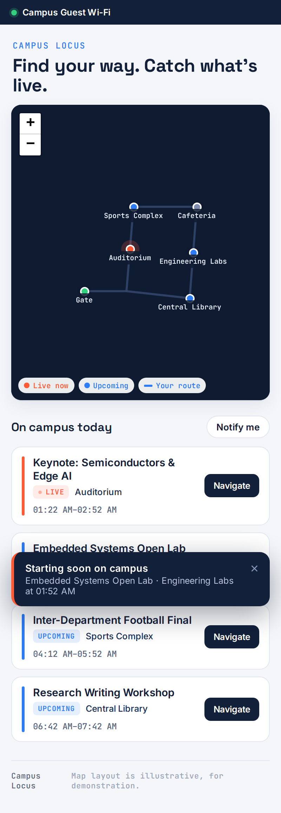
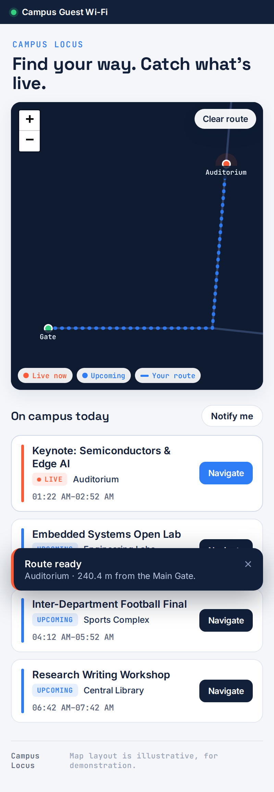
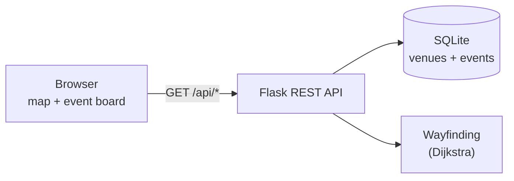

# Campus Locus

**Location-aware campus portal — a Wi-Fi captive-portal landing page with a live
campus map, event board, and walking-route wayfinding.**

[](https://github.com/Urvish-Kosta/campus-locus/actions/workflows/ci.yml)
[](https://www.python.org/)
[](LICENSE)

When a visitor joins the campus guest Wi-Fi, they land on a single page that
shows an interactive campus map, what's happening right now and coming up, and a
one-tap walking route from the gate to any venue — plus an opt-in alert when an
event is about to start.

<p align="center">
  
  &nbsp;&nbsp;
  
</p>

> The campus map layout in this repository is illustrative — an invented campus
> used for the demo, not a map of any real institution.

## Features

- **Captive-portal landing page** — mobile-first page designed to be the first
  thing a visitor sees after joining the network.
- **Live campus map** — interactive [Leaflet](https://leafletjs.com/) map showing
  venues, with live events highlighted and upcoming ones marked.
- **Event board** — live and upcoming events with times and venues, updated
  automatically.
- **Wayfinding** — shortest walking route from the gate to a chosen venue,
  computed with Dijkstra's algorithm and drawn on the map with a distance
  readout.
- **On-device notifications** — opt-in alert (Notifications API + service
  worker) when an event is about to start, with an in-page fallback for
  restricted captive-portal browsers.
- **Installable (PWA)** — web app manifest and service worker for an app-like
  experience and quick reloads on constrained networks.

## Tech stack

| Layer | Technology |
|-------|-----------|
| Backend | Python, Flask, Flask-SQLAlchemy |
| Database | SQLite |
| Frontend | Vanilla JS, Leaflet, service worker (no build step) |
| Wayfinding | Dijkstra shortest path over a weighted campus graph |
| Tests / CI | pytest, GitHub Actions |

## Architecture

A single Flask process serves both the portal page and a JSON API. The browser
renders the map and polls the API for live event data and routes. See
[`docs/architecture.md`](docs/architecture.md) for diagrams and the request
lifecycle.



## Project structure

```
campus-locus/
├── backend/            Flask app, models, API, campus graph, seed data
│   ├── app/
│   │   ├── __init__.py    app factory (API + static serving)
│   │   ├── api.py         REST endpoints
│   │   ├── campus.py      graph model + Dijkstra wayfinding
│   │   ├── models.py      Venue / Event models + status logic
│   │   └── seed.py        fictional campus + demo events
│   ├── config.py
│   └── wsgi.py
├── frontend/           captive-portal page, Leaflet map, service worker, PWA
├── portal-sim/         local captive-portal redirect simulation
├── tests/              pytest suite (API + wayfinding)
├── docs/               architecture, API, deployment, privacy
├── diagrams/           source for the Mermaid diagrams
├── images/             screenshots
└── .github/workflows/  CI
```

## Quick start

Requires Python 3.10+.

```bash
# 1. Clone and enter the repo
git clone https://github.com/Urvish-Kosta/campus-locus.git
cd campus-locus

# 2. Create a virtual environment and install dependencies
python -m venv .venv
source .venv/bin/activate        # Windows: .venv\Scripts\activate
pip install -r backend/requirements.txt

# 3. Seed the demo campus and events
cd backend
python -m app.seed

# 4. Run
flask --app wsgi run
```

Open <http://localhost:5000/>. The event schedule is seeded relative to the
current time, so there is always something live and something upcoming.

To see the captive-portal redirect behaviour, run the simulation in
[`portal-sim/`](portal-sim).

## Usage

- **Browse the map** — pan/zoom; live venues pulse, upcoming ones are marked.
- **Navigate** — tap *Navigate* on any event (or a venue marker) to draw the
  walking route from the gate and see the distance.
- **Get alerts** — tap *Notify me* to opt in; an alert appears when an event is
  within the lead window (default 15 minutes).

## Testing

```bash
pip install -r backend/requirements-dev.txt
pytest tests/ -q
```

The suite covers the API endpoints (health, venues, events, starting-soon,
routing) and the wayfinding algorithm directly.

## Configuration

Set via environment variables (all optional):

| Variable | Default | Purpose |
|----------|---------|---------|
| `NOTIFY_LEAD_MINUTES` | `15` | How far ahead a "starting soon" alert fires |
| `LIVE_GRACE_MINUTES` | `0` | Extra minutes an event stays "live" after it ends |
| `DATABASE_URL` | local SQLite | SQLAlchemy database URL |

## Roadmap

- Server-initiated **Web Push** (VAPID) so alerts arrive when the page is closed.
- Admin interface for creating and editing events.
- Multi-floor / indoor wayfinding with an uploaded campus map overlay.
- Accessibility route options (step-free paths).
- Internationalisation of the portal page.

## Limitations

- Wayfinding is **map-based from a fixed start point** (the gate); it does not
  use real device GPS or indoor positioning.
- Notifications are triggered by client-side polling, not server push, so they
  arrive only while the page is open (see roadmap).
- The captive-portal redirect itself is a network-gateway concern; this repo
  provides a local simulation and deployment notes, not gateway configuration.

## Privacy

The app stores no personal data, does not track device location, and makes
notifications opt-in. See [`docs/privacy.md`](docs/privacy.md).

## Contributing

See [`CONTRIBUTING.md`](CONTRIBUTING.md). Issues and pull requests are welcome.

## License

Released under the [MIT License](LICENSE).

## Author

**Urvish Kosta** — Embedded Systems &amp; Digital Design Engineer
[LinkedIn](https://linkedin.com/in/urvishkosta) · [GitHub](https://github.com/Urvish-Kosta)
