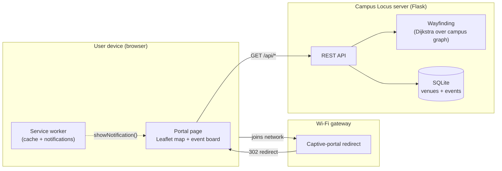
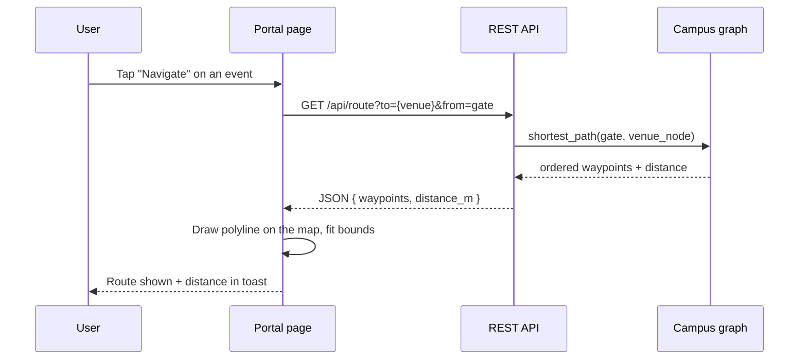
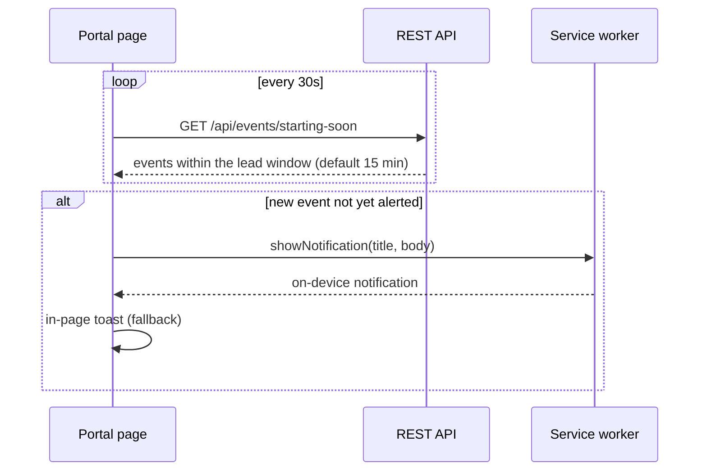
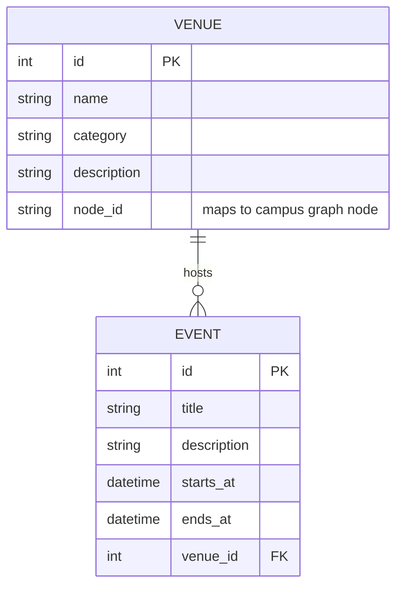

# Architecture

Campus Locus is a small client–server web application. A single Flask process
serves both the captive-portal landing page and a JSON API; the browser renders
an interactive map and polls the API for live data.

## System overview

The captive-portal redirect is a deployment concern handled by the network
gateway (or the local simulation in [`portal-sim/`](../portal-sim)). The
application itself does not depend on it and runs fully from `flask run`.

## Components

| Component | Location | Responsibility |
|-----------|----------|----------------|
| App factory | `backend/app/__init__.py` | Wires Flask, database, CORS, and static serving |
| Models | `backend/app/models.py` | `Venue` and `Event`, plus live/upcoming/ended status logic |
| Campus graph | `backend/app/campus.py` | Node/edge graph and Dijkstra shortest-path |
| REST API | `backend/app/api.py` | Endpoints for campus, venues, events, routes |
| Seed | `backend/app/seed.py` | Fictional campus + time-relative demo events |
| Portal UI | `frontend/` | Landing page, Leaflet map, event board, notifications |
| Service worker | `frontend/sw.js` | App-shell cache and notification surface |

## Request lifecycle: "Navigate to a venue"

## Notification flow: "event starting soon"

## Data model

`Venue.node_id` is the join between the relational data and the campus graph:
each venue names the graph node it sits on, which is what wayfinding routes to.

## Design decisions

- **One process serves page + API.** Simpler to run and to deploy on a gateway;
  no separate frontend build step or server.
- **Planar coordinates, not GPS.** The campus is a schematic graph in local
  metres rendered with Leaflet's simple CRS. The honest capability is
  map-based wayfinding from the gate to a venue — not satellite or indoor
  positioning.
- **Time-relative seed data.** Demo events are seeded relative to "now" so the
  app always has something live and something upcoming, keeping the demo
  reproducible.
- **Polling, not server push (for now).** Notifications are triggered by
  client-side polling of `/events/starting-soon`. Full server-initiated Web
  Push is on the [roadmap](../README.md#roadmap).
