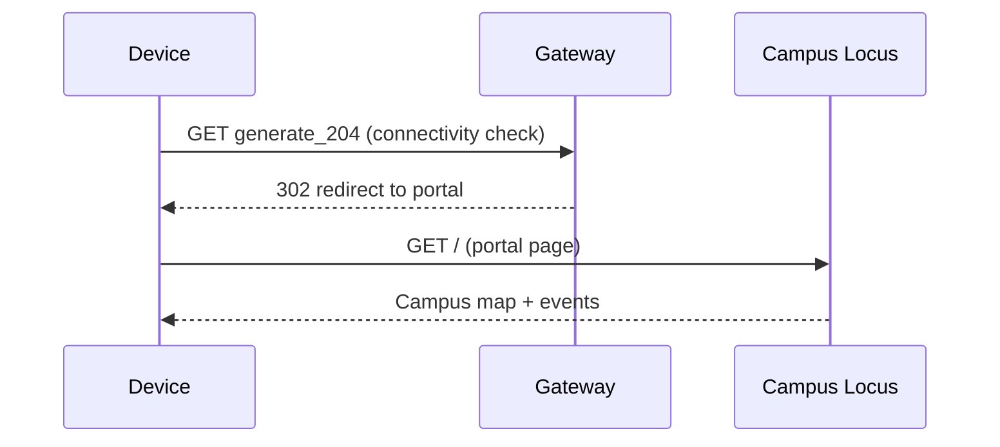

# Captive-portal deployment

Campus Locus serves its own landing page, so you do **not** need a captive
portal to run or demo it. This document explains how the captive-portal
experience — "join Wi-Fi, get redirected to the page" — is produced in a real
deployment, and how to try the behaviour locally.

## How a captive portal works

When a device joins a Wi-Fi network, the OS immediately requests a known
connectivity-check URL (for example Android's `generate_204`, or Apple's
`hotspot-detect.html`). On an open internet connection this returns a success
response and nothing happens. On a captive network, the **gateway intercepts**
that request and returns a redirect to the portal page instead. The OS detects
this and pops up the "Sign in to network" sheet showing the portal.



## Try it locally

The [`portal-sim/`](../portal-sim) folder contains a small server that imitates
the gateway redirect. See its README for commands. This lets you demonstrate
the redirect without any router configuration.

## Real deployment sketch

On a real guest network, the redirect is enforced by the gateway, not the app.
Common options:

- **OpenWRT + nodogsplash / opennds** — point the splash redirect at the host
  running Campus Locus.
- **pfSense / OPNsense captive portal** — set the portal page / redirect URL to
  the app.
- **CoovaChilli / RADIUS** — for networks that also need authentication.

In every case the recipe is the same:

1. Run the app on a host reachable from the guest network
   (`flask --app wsgi run --host 0.0.0.0`), ideally behind a reverse proxy
   with TLS.
2. Configure the gateway to redirect unauthenticated clients to that host.
3. Allow-list the app's host/port in the walled garden so the page and its
   API load before the client is "signed in".

> **Note on scope.** Gateway configuration is environment-specific and out of
> scope for this repository. The app is deployment-agnostic: anything that can
> redirect a browser to it will work.

## Serving in production

Use a WSGI server rather than the Flask development server:

```bash
pip install gunicorn
cd backend
gunicorn --bind 0.0.0.0:5000 "app:create_app()"
```

Put a reverse proxy (nginx, Caddy) in front for TLS. Notifications via the
Service Worker require a secure context (HTTPS), except on `localhost`.
